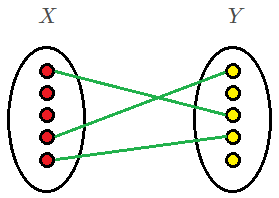
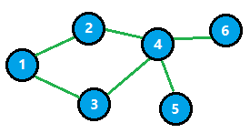
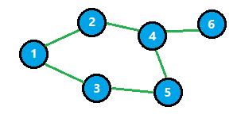
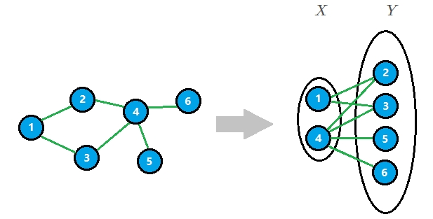
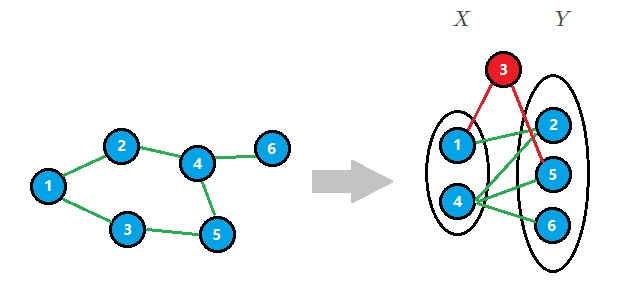
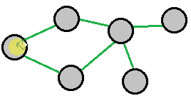
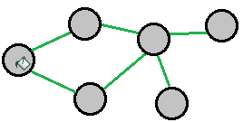

## 前言

图论的算法蕴藏着很多前人的智慧，而且大多数用法很巧妙，匈牙利算法作为相对较为基础的图论算法，是用来求二分图最大匹配问题的。网上对它有很多的解读，比如 Hall 定理、交替路、增广轨、边取反 等等名词，但是这些词汇，对于一个刚接触图论算法的新手来说，是很容易被劝退的。所以为了方便初学者，先不打算郑重其事地介绍这个算法地原理，而是尝试用一些更加口头地术语来解释整个寻找二分图最大匹配的过程。

> 如果从现在开始努力，那么几年后再回头来看，最差也不过是大器晚成

## 二分图

### 什么是二分图

二分图是两个点集 $X$ 和 $Y$ 组成的无向图，其中点集 $X$ 中的点之间互相没有关联，点集 $Y$ 中的点之间互相也没有关联，但是点集 $X$ 和点集 $Y$ 之间有可能存在关联。我们用边来表示两个点之间的关联，如下图所示：


- 用红色点表示 $X$ 集合中的点，互相之间没有边连接；黄色的点表示 $Y$ 集合中的点，互相之间也没有边连接。绿色的直线表示图中的边，用于连接 $X$ 集合和 $Y$ 集合中的点。
- 现实中一个最典型的例子：男人和女人构成的图就是二分图（不考虑特殊情况）



### 二分图的判定

#### 圈的定义

图论中圈的定义是：任选一个顶点为起点，沿着不重复的边，经过不重复的顶点，之后又回到起点的闭合路径。

如下图所示，$(1 \rightarrow 2 \rightarrow 4 \rightarrow 3 \rightarrow 1)$ 为这个图的一个圈。



**奇圈** 就是经过路径的顶点数为奇数的圈，如下图所示，$(1 \rightarrow 2 \rightarrow 4 \rightarrow 5 \rightarrow 3 \rightarrow 1)$ 为这个图的一个 **奇圈**。



#### 二分图判定性质

**二分图的判定**：判断一个图是不是二分图，其实就是判断这个图有没有 **奇圈**。



如上图，我们可以把该图分成两个点集。

但是如果存在 **奇圈**，情况就不一样了。奇圈上的某个点一定既和 $X$ 点集有关联，又和 $Y$ 点集有关联，如下图所示：



#### 二分染色图

二分染色图的算法实现是通过判断一个图中是否存在奇圈从而确定它是否是二分图。

染色算法实现如下：

1. 每次从没有访问过的点中找出一个点作为 **当前节点 $\mu$**，标记颜色 $color[\mu] = 0$
2. 遍历 **当前节点** 的相邻未访问结点 $v$，标记 $color[v] = 1 - color[\mu]$，并且设 **当前节点** 为 $v$
3. 重复步骤 1 和 2 直到所有顶点都被染色完毕

图论算法中，基本都是 **深度优先搜索** 和 **广度优先搜索** 这两个算法的扩展。

下面简单介绍一下染色算法的 **深搜版本** 和 **广搜版本**。

##### 深搜染色

$dyeDFS()$ 用来对每个结点进行递归染色，具体过程如下图所示：



```c++
bool BipartiteGraph::dyeDFS(int fat, int u, int c) {
    if (color_[u] != -1) {
        return color_[u] == c;
    }
    color_[u] = c;
    for (int e = head_[u]; ~e; e = edges_[e].next) {
        int v = edges_[e].to;
        if (!dyeDFS(u, v, 1 - c)) {
            return false;
        }
    }
    return true;
}
```

由于二分图是一个非连通图，所以不是只访问一个结点就能遍历到所有结点的，需要对所有结点都进行一次遍历。$isBipartite()$ 接口用来真正判断一个完整的图是否是二分图。

```c++
bool BipartiteGraph::isBipartite() {
    memset(color_, -1, sizeof(color_));
    for (int i = 1; i <= vertexcount_; i++) {
        if (color_[i] == -1 && !dyeDFS(-1, i, 0)) {
            return false;
        }
    }
    return true;
}
```

##### 广搜染色



```c++
bool BipartiteGraph::dyeBFS(int u) {
    queue <int> Q;
    Q.push(u);
    color_[u] = 0;                                      // 1）
    while (!Q.empty()) {
        int u = Q.front();
        Q.pop();
        for (int e = head_[u]; ~e; e = edges_[e].next) {
            int v = edges_[e].to;
            if (color_[v] == -1) {                     // 2）
                color_[v] = 1 - color_[u];
                Q.push(v);
            }
            else if (color_[v] == color_[u]) {         // 3）
                return false;
            }
        }
    }
    return true;                                       // 4）
}
```


