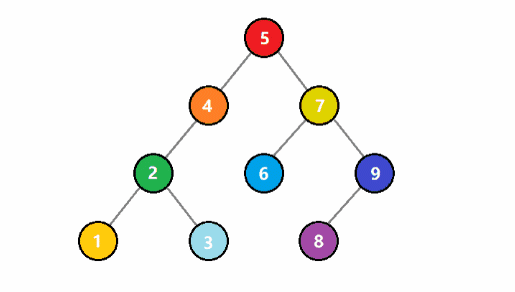
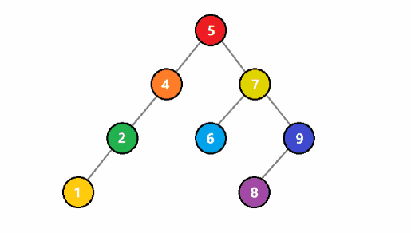
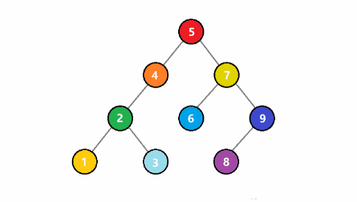

## 概念

### 定义

二叉搜索树，又称为二叉排序树，它满足如下四点性质：

1. 空树是二叉搜索树
2. 若它的左子树不为空，则左子树上所有结点的值均小于它根节点的值
3. 若它的右子树不为空，则右子树上所有结点的值军大于它根节点的值
4. 它的左右子树均为二叉搜索树

### 用途

从二叉搜索树的定义可知，它的前提是二叉树，并且采用了递归的方式进行定义，它的结点间满足一个偏序关系，左子树根节点的值一定比父节点小，右子树根节点的值一定比父节点大。

二叉搜索树可以用来提高搜索的速度，如果对二叉搜索树进行中序遍历，我们可以发现，得到的序列是一个递增序列。


### 数据结构

我们用孩子表示法来定义一颗二叉搜索树的结点。如下：

```c
struct TreeNode {
    int val;
    struct TreeNode *left;
    struct TreeNode *right;
}
```

### 节点创建

```c
struct TreeNode * createNode(int val) {
    struct TreeNode * node = (struct TreeNode*) malloc(sizeof(struct TreeNode));
    node->val = val;
    node-left = NULL;
    node-right = NULL;
    return node;
}
```

## 操作

### 查找

在树上查找某个树是否存在，存在返回 true，否则返回 false。



```c
bool BSTFind(struct TreeNode *root, int val) {
    if (root == NULL) {
        return false;
    }
    if (root->val == val) {
        return true;
    }
    if (val < root->val) {
        return BSTFind(root->left, val);
    }
    if (val > root->val) {
        return BSTFind(root->right, val);
    }
}
```

### 插入



```c
struct TreeNode* BSTInsert(struct TreeNode* root, int val) {
    if (root == NULL) {
        return createNode(val);
    }
    if (val == root->val) {
        return root;
    }
    if (val < root->val) {
        return BSTInsert(root.left, val);
    }
    if (val > root->val) {
        return BSTInsert(root.right, val);
    }
    return root;
}
```

### 删除



```c
int BSTFindMin(struct TreeNode* root) {
    if (root->left) {
        return BSTFindMin(root->left);
    }
    return root->val;
}

struct TreeNode* BSTDelete(struct TreeNode* root, int val) {
    if (NULL == root) {
        return NULL;
    }
    if (val < root->val) {
        return BSTDelete(root->left, val);
    }
    if (val > root->val) {
        return BSTDelete(root->right, val);
    }
    if (val == root->val) {
        return Delete(root);
    }
    return root;
}

struct TreeNode* Delete(struct TreeNode* root) {
    struct TreeNode *delNode, *retNode;
    if (root->left == NULL) {
        delNode = root, retNode = root->right, free(delNode);
    } else if (root->right == NULL) {
        delNode = root, retNode = root->left, free(delNode);
    } else {
        delNode = root;
        retNode = (struct TreeNode*) malloc(sizeof(struct TreeNode));
        retNode->val = BSTFindMin(root->right);
        retNode->right = BSTDelete(root->right, retNode->val);
        retNode->left = root->left;
        free(delNode);
    }
    return retNode;
}
```

### 构造

给定一个数组序列，构造出一颗二叉搜索树。

```c
struct TreeNode* BSTConstruct(int *vals, int valSize) {
    int i;
    struct TreeNode* root = NULL;
    for (i = 0; i < valSize; i++) {
        root = BSTInsert(root, vals[i]);
    }
    return root;
}
```

## 遍历

### 先序遍历

给定一个某二叉搜索树的先序遍历序列，构造出一颗二叉搜索树：

```c
struct TreeNode* preorderCreate(int *vals, int valSize) {
    int i, *index;
    i = 0;
    struct TreeNode* root = NULL;
    struct TreeNode* left = NULL;
    struct TreeNode* right = NULL;
    bool inRight = false;
    for (i = 0; i < valSize; i++) {
        if (i == 0) {
            root = createNode(vals[0]);
        } else if (vals[i] < root->val) {
            if (inRight) return false;
            BSTInsert(root, vals[i]);
        } else if (vals[i] > root->val) {
            inRight = true;
            BSTInsert(root, vals[i]);
        }
    }
    return root;
}
```

### 中序遍历

二叉搜索树的中序遍历是最常用的，一颗二叉搜索树的中序遍历是一个递增序列。

递增序列是存在单调性的，所以可以利用这个特性，在有效的时间内找出这棵树的第 k 大结点。

### 后序遍历

给定一个整数数组，判断该数组是不是某二叉搜索树的后序遍历结果，方法如下：

1. 从后序遍历的定义出发，先左子树，再右子树，最后根节点。所以这个序列的最后一个元素，一定是根节点
2. 如果能够分成这样两部分，则递归计算左右子树
3. 否则，在出现第一个大于最后一个元素的情况下，又出现小于最后一个元素的情况，则表示非法，返回 false


