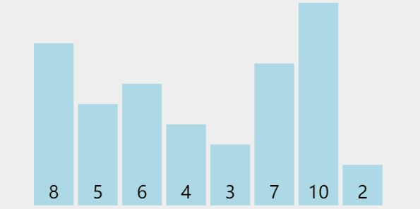

## 动画



## 源码

```typescript
function bubbleSort(nums: number[]) {
    for(let i = 0; i < nums.length; i++) {
        for (let j = 0; j < nums.length - i - 1; j++) {
            if (nums[j] > nums[j+1]) {
                [nums[j], nums[j+1]] = [nums[j+1], nums[j]];
            }
        }
    }
    return nums;
}
```

