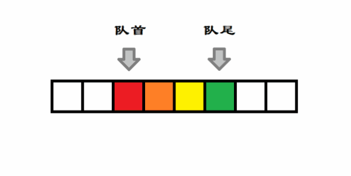
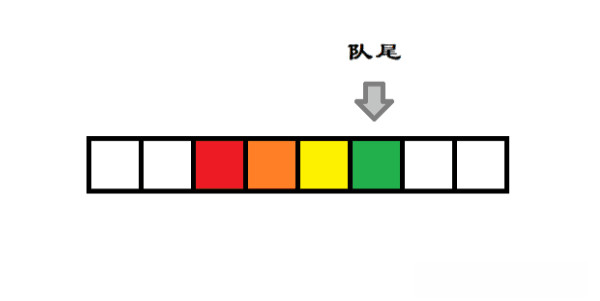
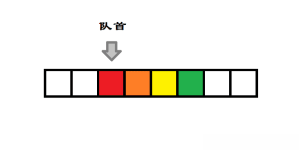

## 概念

### 定义

双端队列是一种具有队列和栈的性质的数据结构，是我们常说的 **deque(double-ended queue)**，是一种限定插入和删除操作在表的两端进行的线性表。这两端分别被称为队首和队尾。


#### 模拟栈

双端队列可以用来在一端进行插入和删除，从而实现栈的功能。如下图所示，代表的是队首固定，队尾循环进行插入和删除操作，从而模拟栈的入栈和出栈过程。



#### 模拟队列

双端队列也可以用限定只在一端插入，另一端删除，从而实现队列的功能。如图所示，代表的是队尾进行插入，队首进行删除，从而模拟 FIFO 队列的入队和出队的过程。


#### 输出受限队列

还可以实现输出受限的双端队列，即一个端点允许插入和删除，另一个端点只允许插入的双端队列。

#### 输入受限队列

也可以实现输入受限的双端队列，即一个端点允许插入和删除，另一个断电只允许删除的双端队列。这种结构，我们一般可以用它来实现单调队列。

### 队首

双端队列的一端被称为队首，如下图所示：



### 队尾

双端队列的另一端被称为队尾，如下图所示：



## 接口

可写接口：队首入队、队尾入队、队首出队、队尾出队、清空队列

只读接口：获取队列元素个数、判空、获取队首元素、获取队尾元素

## 顺序表实现

```typescript
const queue: any[] = [];
```

### 队首入队

```typescript
queue.unshift(val);
```

### 队尾入队

```typescript
queue.push(val);
```

### 队首出队

```typescript
queue.shift();
```

### 队尾出队

```typescript
queue.pop();
```

### 清空队列

```typescript
queue.length = 0;
```

### 只读接口

```typescript
queue[0];
queue[queue.length - 1];
queue.length;
!queue.length;
```

## 链表实现

### 数据结构

```typescript
type QueueNode = {
    data: any;
    prev: QueueNode;
    next: QueueNode;
}

type Queue = {
    head: QueueNode;
    tail: QueueNode;
    size: number;
}
```

### 创建结点

```typescript
function createQueueNode(val: any;) {
    return {
        data: val,
        next: null,
        prev: null,
    };
}
```

### 入队操作

```typescript
function enqueue(queue: Queue, data: any, isFrontOrRear: number = 1) {
    const node = createQueueNode(data);
    if (queue.size === 0) {
        queue.head = queue.tail = node;
    } else {
        if (isFrontOrRear === 1) {
            node.next = queue.head;
            queue.head.prev = node;
            queue.head = node;
        } else if (isFrontOrRear === 2) {
            node.prev = queue.tail;
            queue.tail.next = node;
            queue.tail = node;
        }
    }
    queue.size++;
    return queue;
}
```

### 出队操作

```typescript
function dequeue(queue: Queue, isFrontOrRear: number = 1) {
    if (!queue.size) {
        return queue;
    }
    if (queue.size === 1) {
        queue.head = queue.tail = null;
    } else {
        if (isFrontOrRear === 1) {
            queue.head = queue.head.next;
            queue.head.prev = null;
        } else if (isFrontOrRear === 2) {
            queue.tail = queue.tail.prev;
            queue.tail.next = null;
        }
    }
    queue.size--;
    return queue;
}
```

### 清空队列

```typescript
function clearQueue(queue: Queue) {
    while(queue.size) {
        dequeue(queue);
    }
}
```

### 只读接口

```typescript
function getFront(queue: Queue) {
    return queue.head.data;
}
function getRear(queue: Queue) {
    return queue.tail.data;
}
function getSize(queue: Queue) {
    return queue.size;
}
function isEmpty(queue: Queue) {
    return !queue.size;
}
```


