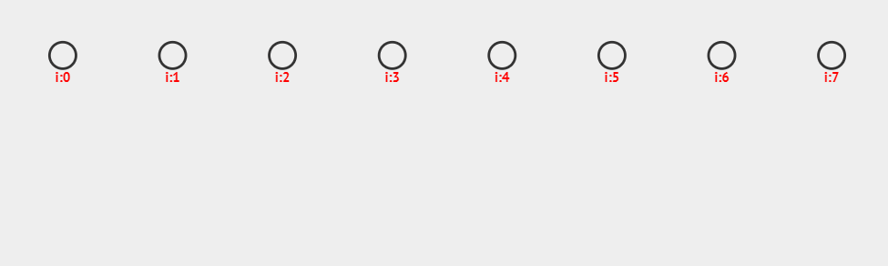
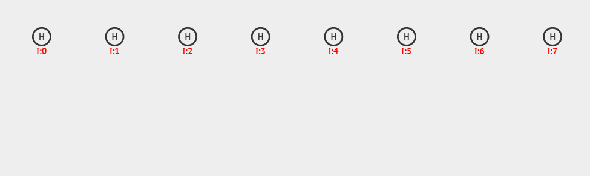

## 哈希表的概念

### 查找算法

当我们在一个 链表 或者 顺序表 中 查找 一个数据元素 是否存在 的时候，唯一的方法就是遍历整个表，这种方法称为 **线性枚举**。


如果这时候，顺序表是有序的情况下，我们可以采用折半的方式去查找，这种方法称为 **二分枚举**。

线性枚举 的时间复杂度为 $O(n)$。二分枚举 的时间复杂度为 $O(\log_2n)$。是否存在更快的查找方式？这就是我们这里要介绍的新的数据结构——哈希表。

### 哈希表

由于哈希表不是顺序结构，所以很多数据结构书上称之为 散列表，这里我们统一用哈希表的形式来说明，作为读者，只需要知道这两者是同一种数据结构即可。

我们把需要查找的数据，通过一个函数映射，找到存储数据的位置的过程称为哈希。这里涉及到几个概念：

1. 需要查找的数据本身被称为关键字
2. 通过函数映射将关键字变成一个哈希值的过程中，这里的函数被称为哈希函数
3. 生成哈希值的过程可能会产生冲突，需要进行冲突解决
4. 解决完冲突以后，实际存储数据的位置被称为哈希地址，通俗的说，它就是一个数组下标
5. 存储所有这些数据的数据结构就是哈希表，程序实现上一般采用数组实现，所以又叫哈希数组


### 哈希数组

数组类型可以是任意类型，每个位置被称为一个槽。


### 关键字

关键字是哈希数组中的元素，可以是任意类型

```c
int A = 5;
char C[100] = "Hello World!";
struct Obj {};
Obj M;
```

### 哈希函数

哈希函数可以简单的理解为就是小学课本上那个函数，即 $y = f(x)$，这里的 $f(x)$ 就是哈希函数，$x$ 是关键字，$y$ 是哈希值。好的哈希函数应该具备一下两个特质：

1. 单射
2. 雪崩效应：输入值 $x$ 的 1 比特的变化，能够造成输出值 $y$ 至少一半比特的变化

单射很容易理解，如下图所示，图(a) 中已知哈希值 $y$ 是，键 $x$ 可能有两种情况，所以不是一个单射；而图(b) 中已知哈希值 $y$ 时，键 $x$ 的值一定是唯一确定的，所以它是单射。


### 哈希冲突

哈希函数生成哈希值的过程中，如果产生 不同的关键字得到了相同的哈希值的情况，就被称为 哈希冲突。

冲突的解决方法有很多，主要有：开放定址法、再散列函数法、链地址法、公共溢出法等等

### 哈希地址

哈希地址就是一个数组下标，即哈希数组的下标。通过下标获得数据，被称为索引。通过数据获得下标，被称为哈希。平时工作的时候，和同事交流时用到的一个词 反查 就是说的 哈希。


## 常用哈希函数

### 直接定址法

直接定址法就是关键字本身就是哈希值，表示成函数值就是 $f(x) = x$。

例如，我们需要统计一个字符串中每个字符的出现次数，就可以通过这种方法。任何一个字符的范围都是 $[0, 255]$，所以只需要用一个长度为 256 的哈希数组就可以存储每个字符出现的次数。

```typescript
const arr: number[] = [];

for (let i = 0; i < str.length; i++) {
    arr[str[i].charCodeAt()] ? arr[str[i].charCodeAt()]++ : (arr[str[i].charCodeAt()] = 1);
}
```

### 平方取中法

平方取中法就是对关键字进行平方，再取中间的某几位作为哈希值。

例如，对于关键字 $1314$，得到平方为 $1726596$，取中间三位作为哈希值，即 $265$。

平方取中法适用于不清楚关键字的分布，且位数也不是很大的情况。

### 折叠法

折叠法是将关键字分割成位数相等的几部分（最后一部分位数不够可以短一些），然后再进行求和，得到一个哈希值。

例如，对于关键字 $5201314$，将它分为四组，并且相加得到：$52 + 01 + 13 + 14 = 88$，这就是哈希值。

折叠法比较适用于不清楚关键字的分布，但是关键字位数较多的情况。

### 除留余数法

除留余数法就是 关键字 模上 哈希表 长度，表示成函数值就是：$f(x) = x \space mod \space m$。

其中 $m$ 代表了哈希表的长度，这种方法，不仅可以对关键字直接取模，也可以在平方取中法、折叠法之后再取模。


### 位与法

哈希数组的长度一般选择 2 的幂，因为我们知道取模运算是比较耗时的，而位运算相对比较高效。

选择 2 的幂作为数组长度，可以将 取模运算 转换成 二进制的位与。

令 $m = 2^k$，那么它的二进制表示就是：$m = \big(\underbrace{1000\dots000}_k\big)_2$，任何一个数模上 $m$，就相当于取了 $m$ 的二进制低 $k$ 位，而 $m - 1 = \big(\underbrace{111\dots111}_k\big)_2$，所以模上 $m$ 和位与 $m-1$ 的效果是一样的。即：

$x\space\%\space S == x\space \& \space (S - 1)$

除了直接定址法，其他三种方法都有可能导致哈希冲突，接下来，我们就来讨论下常用的一些哈希冲突的解决方案。

## 常见哈希冲突的解决方案

### 开放定址法

开发定址法就是一旦发生冲突，就去寻找下一个空的地址，只要哈希表足够大，总能找到一个空的位置，并且记录下来作为它的哈希地址，公式如下：
$$
f_i(x) = (f(x) + d_i) \space mod \space m
$$
这里 $di$ 是一个数列，可以是常数列 $(1,1,1,\dots,1)$，也可以是等差数列 $(1,2,3,\dots,m-1)$。



  上图中，采用的是哈希函数算法是 除留余数法，采用的哈希冲突解决方案是 开放定址法，哈希表的每个数据就是一个关键字，插入之前需要先进行查找，如果找到的位置未被插入，则执行插入；否则，找到下一个未被插入的位置进行插入；总共插入了 6 个数据，分别为：11、12、13、20、19、28。
  这种方法需要注意的是，当插入数据超过哈希表长度时，不能再执行插入。

### 再散列函数法

再散列函数法就是一旦发生冲突，就采用另一个哈希函数，可以是平方取中法、折叠法、除留余数法 等等的组合，一般用两个哈希函数，产生冲突的概率就已经微乎其微了。

### 链地址法

产生冲突后，我们也可以选择不换位置，还是在原来的位置，只是把 哈希值 相同的用链表串联起来。这种方法叫做 链地址法。



  上图中，采用的是哈希函数算法是 除留余数法，采用的哈希冲突解决方案是 链地址法，哈希表的每个数据保留了一个 链表头结点 和 尾结点，插入之前需要先进行查找，如果找到的位置，链表非空，则插入尾结点并且更新尾结点；否则，生成一个新的链表头结点和尾结点；总共插入了 6 个数据，分别为：11、12、13、20、19、28。


