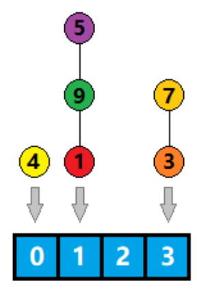

## 前言

哈希表在数据结构中相对来说比较基础的，但是对于 广度优先搜索 和 动态规划 里涉及到的 **状态哈希** 还是有必要简单讲一讲。所谓的 **状态** 到底是什么概念？以及为什么要对状态进行哈希？

## 哈希表

### 概念

哈希表（Hash table）的初衷是为了将关键字值（key - value）映射到数组中的某个位置，这样就能够通过数组下标访问该数据，省去了遍历整个数据结构的过程，从而提高了数据的查找速度，查找的平均期望时间复杂度是 $O(1)$。

redis 中的 **键值对**、python 中的 **dict**、lua 中的 **table**、C++ STL 中的 **unordered_map** 等等，底层都是采用哈希表来实现的，可见哈希表在实际应用中还是很广泛的。

#### 哈希数组

可以用数组来实现哈希表，数组类型可以是任意类型，每个位置被称为一个槽（slot）。


#### 关键字

关键字 key 是任意类型，可以是整型、长整型、字符串甚至是结构体或者类

```c++
int a = 5;
string b = "Hello World!";
class Obj {};
Obj 0;
```

哈希表的实现中，我们需要通过一些手段，将一个非整型的关键字转换成整型，然后再对哈希数组的长度进行取模，转换为下标，从而找打它所对应的位置，实现快速关键字查找。


而将一个非整型关键字转换成整型的手段就是 **哈希函数**

#### 哈希函数

$y = f(x)$，这里的 $f(x)$ 就是哈希函数，$x$ 是关键字，$y$ 是值。

好的哈希函数应该具备以下两个特质：

1. 单射（一一映射）
2. 雪崩效应：输入值 $x$ 的 1 位变化，能够造成输出值 $y$ 1/2 的位的变化

雪崩效应是为了让哈希值更加符合随机分布的原则，哈希表中的键分布的越随机，利用率越高，效率也越高

整数的哈希函数比较简单，可以为自身：$hash(x) = x$

字符串的哈希函数设计的时候，一般是遍历整个字符串进行某种运算，最后得到一个长整型：
$$
hash(s) = 9456043234891890ll
$$
类的哈希函数，设计的时候可以先实现一个 toString 方法转换成字符串，然后再对这个字符串进行哈希；

#### 值

这里的值，就是之前提到的哈希数组的类型

整个哈希过程就是通过 关键字 找 值 的过程

### 简单下标哈希

简单下标哈希就是利用关键字直接访问数组元素，省去了计算哈希值、取模、以及寻址的过程：


### 散列哈希

我们来介绍一个更加一般的情况，即通过一个不在数组范围内的整型（或长整型），通过计算得到它的值。


#### 哈希值离散

实际的问题中，我们的数组可能没有那么大，或者哈希值比较离散，离散的反义词是连续，例如：（1，3，4，6）相对于（1，2，3，4）就是离散的。


这种情况下，就不方便直接采用下标映射

#### 除留余数法

由于数组的长度为 4，所以我们可以将哈希值 **模 4** 再进行映射。


取模意味着求余数，如上图所示，就可以得到一个连续的数组下标。

如果用 $x$ 代表哈希值，$f(x)$ 代表实际映射的下标，则有：$f(x) = x \mod 4$

这样就解决了哈希值离散的问题，但同时也带来了另一个问题，就是 **哈希冲突**

#### 哈希冲突

所谓哈希冲突，就是两个不同的哈希值通过取模映射到了同一个下标，这样就会产生二义性：


为此，就需要有一些应对哈希冲突的解决方案，常用的有：链地址法、开放寻址法、再散列法

##### 链地址法

数组存储值数据的链表头，将所有取模后一样的哈希值用链表串起来，查找的时候先取模找到对应下表位置，然后再在链表上遍历找到对应哈希值的数据



在极端情况下，哈希值会退化为链表（模 4 同余）

##### 开放寻址法

数组存储值数据，如果遇到取模后发现已经有数据，则往数组后移一位，如果还有就继续移动，直到找到一个空闲位置。


哈希值 9 对 4 取模以后值为 1，但是发现下标为 1 的位置上已经有元素了，于是往后继续找下一个，找到下标为 2 的位置

这种方法对不同的哈希值的个数要求有限制，必须小于等于哈希数组的大小，否则永远找不到就会产生死循环，而且随着哈希值增多，插入和查找的效率也会下降。

##### 负载因子

无论是链地址法还是开放地址法都会遇到一个问题，就是一旦数据量上去以后，都会导致查找效率下降，于是这里引入一个负载因子的概念：
$$
负载因子 = 哈希值个数 / 哈希数组长度
$$
对于链地址法来说，负载因子 > 5 就要考虑 rehash 了；而对于开放寻址法，负载因子 > 0.7 时，就要考虑 rehash 了，那么什么是 **rehash** 呢？

##### rehash

所谓 rehash，就是申请一块新的空间，空间的大小为原哈希数组的两倍，然后把原有的数据全部取出来映射到新的哈希数组里，再释放原有的哈希数组。

实际实现的时候，为了减少申请空间带来的开销，一般是预先就一直有两个哈希数组（指针），然后采用滚动的方式进行扩容，扩容完毕交换指针。

并且由于一次 rehash 的耗时可能比较长，一般采用渐进式 rehash，分散 CPU 的执行时间，具体细节可以参考 redis 源码的实现，这里就不再展开来说了。

##### 取模位运算优化

哈希数组的长度一般选择 2 的幂，因为我们知道取模运算是比较耗时的，而位运算相对比较高效。

选择 2 的幂作为数组长度，可以将 取模运算 转换成 二进制的位与（&）。

令 $S = 2^k$，那么它的二进制表示就是：$S = \big(1\underbrace{000\dots000}_k\big)_2$，任何一个数模上 $S$，就相当于取了 $S$ 的二进制低 $k$ 位，而 $S - 1 = \big(\underbrace{111\dots111}_k\big)_2$，所以和 **位与** $S-1$ 的效果是一样的。
$$
x \% S == x \& (S - 1)
$$

### 散列哈希的实现

这里介绍一种简单的哈希再散列的实现，为了尽量优化代码，假设了几个问题：

1. 不涉及 rehash：哈希数组长度够大，元素个数可控
2. 不考虑负载因子：因为不进行 rehash，自然也不用考虑负载因子了
3. 采用开放寻址法：不用链地址法，避免申请内存的开销

```c++
#define HashValueType long long
const int MAXH = (1 << 20);
bool hashkey[MAXH];
HashValueType hashval[MAXH];

int getKey(HashValueType val) {
    int key = (val & (MAXH - 1));
    while (1) {
        if (!hashkey[key]) {
            hashkey[key] = true;
            hashval[key] = val;
            return key;
        } else {
            if (hashkey[key] == val) {
                return key;
            }
            key = (key + 1) & (MAXH-1);
        }
    }
}
```

根据类似的方法可以实现一个只查找不插入的方法，实现如下：

```c++
bool hasKey(HashValueType val) {
    int key = (val & (MAXH - 1));
    while (1) {
        if (!hashkey[key]) {
            return false;
        } else {
            if (hashval[key] == val) {
                return true;
            }
            key = (key + 1) & (MAXH - 1);
        }
    }
}
```

### 字符串哈希

最后，我们来了解下对于字符串类型的关键字，如何计算哈希值，也就是如下图所示：


#### B 进制

对于一个字符串 “1314”，我们可以认为它是一个十进制数，转换成十进制就是：
$$
1 \times 10^3 + 3 \times 10^2 + 1 \times 10^1 + 4 \times 10^0 = 1314
$$
也可以认为它是一个 8 进制数，那么转换成十进制就是：
$$
1 \times 8^3 + 3 \times 8^2 + 1 \times 8^1 + 4 \times 8^0 = 716
$$
同样，也可以认为它是个 16 进制的数，那么转换成十进制就是：
$$
1 \times 16^3 + 3 \times 16^2 + 1 \times 16^1 + 4 \times 16^0 = 4884
$$
更一般来说，对于所有大于 4 的进制其实都可以唯一表示这个字符串。

对于任意一个字符串，其实都是由 ASCII 字符组成，而每个字符都用 1 个字节表示，即它的范围是 $[0, 255]$，所以我们可以用大于 255 的数来代替进制 B，即任意一个长度为 $k$ 的字符串 $s$ 可以表示为唯一的整数如下：

（其中 $s[i]$ 代表第 $i$ 个字符的 ASCII 码值，$i$ 下标从 1 开始）
$$
hash(s) = s[1] \times B^{k-1} + s[2] \times B^{k-2} + \dots + s[k] \times B^{0} (B \ge 256)
$$

#### 取模

随着字符串长度不断变大，算出来的哈希值也会越来越大，从而产生溢出，所以一般采取模上一个较大的素数的形式：
$$
hash(s) = s[1] \times B^{k-1} + s[2] \times B^{k-2} + \dots + s[k] \times B^{0} (B \ge 256)\mod P
$$
这样做仍然能够保证相同的字符串得到的哈希值是一样的，但是却无法保证不相同的字符串计算的哈希值不同，所以为了尽量不让不同的字符串映射到相同的整数，$P$ 的取值就很关键，一般采取较大的素数的形式，进一步的，$B$ 也选择一个和 $P$ 互素的素数更佳。

（素数：大于 1 的自然数中，除了 1 和它本身外，无法被其他数整数的数）

#### 自然溢出

根据补码的性质，C++ 中如果定义了 unsigned long long，溢出的部分等同于对 $P = 2^{64}$ 取模，这样就可以无视取模，任其自然溢出了。

自然溢出有利有弊：好处就是效率会高出不少，而且能够表示的范围已经是长整型能够表示的最大范围，很大程度上减少哈希冲突；坏处就是取模效果没有素数来的好，对于一些特殊构造的数据，容易造成布咸通的字符串计算出相同的哈希值的情况。

#### 双哈希

当有大量字符串时，这种冲突会被放大，我们可以通过取两对 $(B_0, P_0), (B_1, P_1)$ 的值，进行双哈希，然后取两次哈希值组成一个新的哈希值，从而大大减少冲突的概率。
$$
hash(0, s) = s[1] \times B_0^{k-1} + s[2] \times B_1^{k-1} + \dots
$$

#### 子串哈希值

对于一个字符串 s，s[l: r] 代表 s 从 l 到 r 的子串；
$$
hash(s[1:1]) = (s[1] * B^0) \mod P
$$

$$
hash(s[1:2]) = (s[1] * B^1 + s[2] * B^0) \mod P
$$

$$
hash(s[1:3]) = (s[1] * B^2 + s[2] * B^{1} + s[3] * B^0) \mod P
$$

$$
hash(s[1:4]) = (s[1] * B^3 + s[2] * B^2 + s[3] * B^1 + s[4] * B^0) \mod P
$$

$$
hash(s[1:5]) = (s[1] * B^4 + s[2] * B^3 + s[3] * B^2 + s[4] * B^1 + s[5] * B^0) \mod P
$$


那么我们如何求 $hash(s[3:5])$ 呢？

直接求解，可以得到：
$$
hash(s[3:5]) = (s[3] * B^2 + s[4] * B^1 + s[5] * B^0) \mod P
$$
那么通过如下减法可以得到：
$$
hash(s[1:5]) - hash(s[3:5]) &=& (s[1] * B^4 + s[2] * B^3) \mod P \\
&=&B^3 * (s[1] * B^1 + s[2] * B^0) \mod P \\
&=&B^3 * hash(s[1:2])
$$
移项后整理式子，得到：
$$
hash(s[3:5]) = (hash(s[1:5]) - B^3 * hash(s[1:2]))
$$
对于更一般的情况，令 $h(r) = hash(s[1:r]))$，有：
$$
hash(s[l:r]) = (h(r) - B^{r-l+1} * h(l-1))
$$
其中 $h(i)$ 和 $B^i$ 都可以事先一次线性扫描预处理后放在数组中，则每次取子串哈希值的时间复杂度为 $O(1)$。


