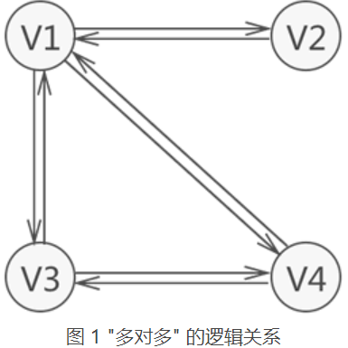
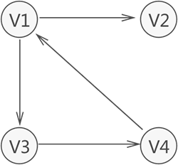
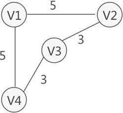
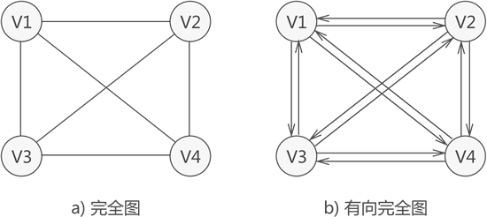

>图通常用来表示和存储具有”多对多“关系的数据，是数据结构中非常重要的一种结构

一个学生可以同时选择多门课程，而一门课程可以同时被多名学生选择，学生和课程之间的逻辑关系就是”多对多“。

> $A \rightarrow B$ 表示 A 和 B 之间存在单向的关系，由 A 可以找到 B，但由 B 找不到 A

和链表不同，图中存储的各个元素被称为顶点（而不是结点）。用图 1 来说，图中含有 4 个顶点，分别为顶点 V1、V2、V3 和 V4。

通常情况下，我们习惯用 $V_i$ 表示图中的顶点，且所有顶点构成的集合通常用 $V$ 来表示。比如说，图 1 中顶点的集合为 $V = \{ V_1, V_2, V_3, V_4 \}$ 。

图 1 中各个顶点之间的关系都是双向的，这种情况下我们可以用下图来表示各个元素之间的关系：

图 2 图存储结构

> $A - B$ 表示 A 和 B 之间存在双向的联系，由 A 可以找到 B，同样由 B 也可以找到 A。

像图 2 这样，各个元素之间的联系都是双向的，这样的图称为 **无向图**。如果元素之间只存在单向的联系，那么这样的图结构称为 **有向图**，如下：

图 3 有向图

## 图的基本概念

### 1. 弧头和弧尾

有向图中，无箭头一端的顶点通常被称为 **”初始点“** 或 **”弧尾“**，箭头一端的顶点被称为 **”终端点“** 或 **”弧头“**。

可以猜到，**弧** 就是指 **边**

### 2. 入度和出度

对于有向图中的一个顶点 $V$ 来说，箭头指向 $V$ 的弧的数量为 $V$ 的 **入度**（Indegree，记为 $ID(V)$）；箭头远离 $V$ 的弧的数量为 $V$ 的 **出度**（OutDegree，记为 $OD(V)$）。

用图 3 的顶点 $V1$ 来说，该顶点的入度为 1，出度为 2，该顶点的 **度** 为 3.

### 3. $(V1, V2)$ 和 $<V1, V2>$ 的区别

无向图中描述两顶点 $V1$ 和 $V2$ 之间的关系可以用 $(V1, V2)$ 来表示；有向图中描述从 $V1$ 到 $V2$ 的”单向“关系可以用 $<V1, V2>$ 来表示。

由于图存储结构中顶点之间的关系是用线来表示的，因此 $(V1, V2)$ 还可以用来表示无向图中连接 $V1$ 和 $V2$ 的线，又称为 **边**；同样，$<V1, V2>$ 也可用来表示有向图中从 $V1$ 到 $V2$ 带方向的线，又称为 **弧**。

### 4. 集合 VR

图中习惯用 $VR$ 表示图中所有顶点之间关系的集合。例如，图 1 中无向图的集合 $VR = \{(V1, V2), (V1, V4), (V1, V3), (V3, V4)\}$，图 2 中有向图的集合为 $VR=\{<V1, V2>, <V1, V3>, <V3, V4>, <V4, V1>\}$

### 5. 路径和回路

无论是无向图还是有向图，从一个顶点到另一个顶点途径的所有顶点组成的序列（包含这两个顶点），称为一条 **路径**。如果路径中第一个顶点和最后一个顶点相同，则此路径称为 **回路（或环）**。

在此基础上，若路径中各顶点都不重复，此路径被称为 “简单路径”；若回路中的顶点互不重复，此 “回路” 被称为 “简单回路”（或简单环）。

对于图 1 来说，从 $V1$ 存在一条路径还可以回到 $V1$，此路径为 $\{V1, V3, V4, V1\}$，这是一个回路（环），而且是一个简单回路（简单环）。

> 在有向图中，每条路径或回路都是有方向的。

### 6. 权和网

有些场景中，可能会为图中的每条边赋予一个实数表示一定的含义，这种与边（或弧）相匹配的实数被称为 “权”，而带权的图通常称为 **网**。例如，图 4 就是一个网结构：

图 4 网结构（带权的图）

### 7. 子图

指的是由图中一部分顶点和边构成的图，称为原图的子图。

## 图存储结构的分类

根据不同的特征，图又可以细分为 **完全图**、**连通图**、**稀疏图** 和 **稠密图**：

- 完全图：若图中各个顶点都与除自身外的其他顶点有直接关系，这样的无向图称为 **完全图**，如图 5a。同时，满足此条件的有向图则称为 **有向完全图**。

图 5 完全图

> 具有 n 各顶点的完全图，图中边的数量为 $\frac{n(n-1)}{2}$；而对于具有 n 各顶点的有向完全图，图中弧的数量为 $n(n-1)$。

- 稀疏图和稠密图：这两种图是相对存在的，即如果图中具有很少的边或弧，此图就称为 稀疏图；反之，则称此图为 稠密图。

> 稀疏和稠密的判断条件是：$e \lt n\log{n}$，其中 e 表示图中边或弧的数量，n 表示图中顶点的数量。如果式子成立，则为稀疏图；反之为稠密图。

- 连通图：比较复杂，之后单独介绍

