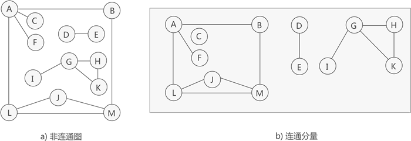

## 连通图

图中从一个顶点到另一个顶点，若存在至少一条路径，则称这两个顶点是联通着的。例如图 1 中，虽然 V1 和 V3 没有直接关联，但从 V1 到 V3 存在两条路径，分别是 $V1-V2-V3$ 和 $V1-V4-V3$，因此称 $V1$ 和 $V3$ 之间是连通的。

图 1 顶点之间的联通状态示意图 

**无向图**中，如果任意两个顶点之间都能够连通，则称此无向图为 **连通图**。例如，图 2 中的无向图就是一个连通图，因此此图中任意两点之间都是连通的。

图 2 连通图示意图

若无向图不是连通图，但图中存储某个子图符合连通图的性质，则称该子图为 **连通分量**。

> 图中部分顶点和边构成的图为该图的一个子图，但这里的子图值得是图中“最大”的连通子图（也称“极大连通子图”）。

如图 3 所示，虽然图 3a) 中的无向图不是连通图，但可以将其分解为 3 个“最大子图”（图 3b），它们都满足连通图的性质，因此都是连通分量。

图 3 连通分量示意图

> 图 3a 中的无向图只能分解为 3 部分各自联通的“最大子图”

## 强连通图

**有向图**中，若任意两个顶点 $V_i$ 和 $V_j$，满足从 $V_i$ 到 $V_j$ 以及从 $V_j$ 到 $V_i$ 都连通，也就是都含有至少一条通路，则称此有向图为 **强连通图**。如图 4 所示就是一个强连通图。

图 4 强连通图

与此同时，若有向图本身不是强连通图，但其包含的最大连通子图具有强连通图的性质，则称该子图为 **强连通分量**。

图 5 强连通分量

如图 5 所示，整个有向图虽不是强连通图，但其含有两个强连通分量。

## 总结

可以这样理解，连通图是在无向图的基础上对图中各顶点之间的连通做了更高的要求，而强连通图是在有向图的基础上对图中顶点的连通做了更高的要求。

