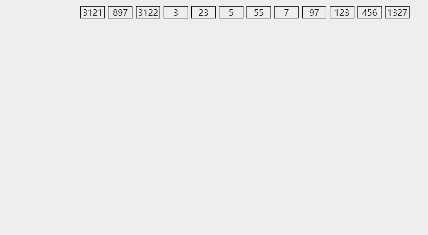

## 释义

### 目的

将原本乱序的数组变得有序，可以是【升序】或者【降序】，本文只讨论【升序】

### 思想

首先，准备 10 个队列，进行若干次【迭代】。每次【迭代】，先清空队列，然后取每个待排序数的对应十进制位，通过【哈希】，映射到它【对应的队列】中，然后将所有数字【按照队列排序】塞回【原数组】完成一次【迭代】。

可以认为类似【关键字排序】，先对【第一关键字】进行排序，再对【第二关键字】排序，以此类推，知道所有关键字都有序为止。

## 演示



## 实现

### 问题描述

> 给定一个 $n$ 个元素的整型数组，数组下标从 0 开始，且数组元素范围为 $[1, 10^8)$，采用【基数排序】将数组按照【升序】排列

```typescript
const base = 10;

const getRadix = (val: number, radix: number[], p: number) => {
    return Math.floor(val / radix[p]) % base;
}

const radixSort = (nums: number[]) => {
    let p = 0;
    const radix = [1];
    const radixArray: Array[number[]] = [];
    for (let i = 1; i < 8; i++) {
        radix[i] = radix[i-1] * base;
    }
    while (p < 8) {
        radixArray.length = 0;
        for (let i = 0; i < nums.length; i++) {
            const rdx = getRadix(nums[i], p);
            if (!radixArray[rdx]) {
                radixArray[rdx] = [nums[i]];
            } else {
                radixArray[rdx].push(nums[i]);
            }
        }
        let index = 0;
        for (let i = 0; i < base; i++) {
            for (let j = 0; j < radixArray[i].length; j++) {
                nums[index++] = radixArray[i][j];
            }
        }
        ++p;
    }
}
```

时间复杂度：$O(nk)$

空间复杂度：$O(nb), b = 10$


