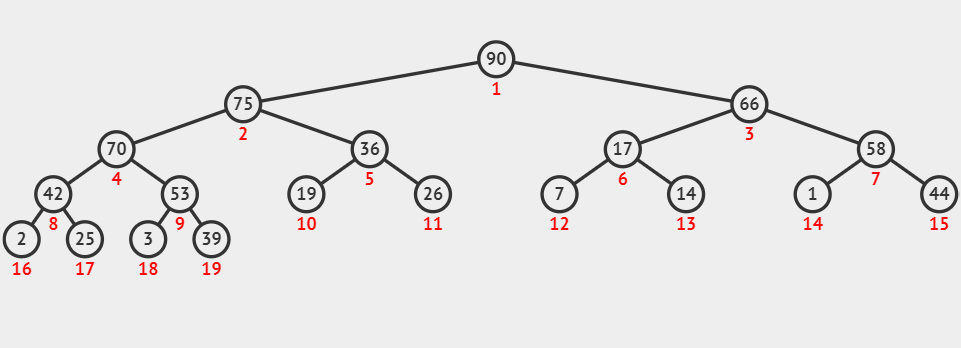
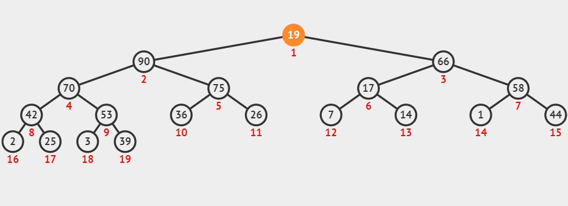
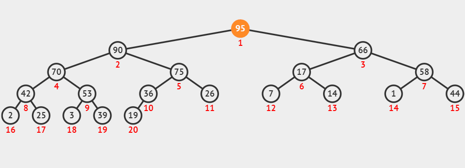

## 概念

堆是计算机科学中一类特殊的数据结构的统称。实现有很多，如：大顶堆，小顶堆，斐波那契堆，左偏堆，斜堆等等。

从子节点个数上可以分为二叉堆、N 叉堆等等。我们这里介绍二叉堆。

### 定义

二叉堆本质是一颗完全二叉树，所以每次元素的插入和删除都能保证 $O(\log_2n)$。根据堆的偏序规则，分为 小顶堆 和 大顶堆。小顶堆，就是根节点的的关键字最小，大顶堆则相反。

下图表示一个大顶堆：


### 性质

以大顶堆为例，总是满足如下性质：

1. 空树是一个大顶堆
2. 大顶堆中某个结点的关键字 **小于等于** 其父节点的关键字
3. 大顶堆是一颗完全二叉树


从任意一个叶子节点到根节点的路径总是一个单调不降的序列

### 作用

对于大顶堆，能在 $O(1)$ 的时间内，获得关键字的最大元素。并且能够在 $O(\log_2n)$ 的时间内执行插入和删除。一般用来做 优先队列 的实现。

## 存储结构

一种新的表示形式：利用 **数组** 来表示 **链式结构**。

对于完全二叉树，我们可以把每个结点，按照层序映射到一个顺序存储的数组中。


如图，节点上的数字表示数组下标。从左到右按照层序连续递增。

### 根节点编号

```c
#define root 0
```

### 孩子结点编号

根据数学归纳法，可以得出：

```c
#define lson(idx) (2*idx + 1)
#define rson(idx) (2*idx + 2)
```

也可以用左移位运算符来表示：

```c
#define lson(idx) (idx << 1 | 1)
#define rson(idx) ((idx + 1) << 1)
```

### 父节点编号

同样根据数学归纳法可得：

```c
#define parent(idx) ((idx - 1) / 2)
```

当然也可以用右移位运算符来表示：

```c
#define parent(idx) ((idx - 1) >> 1)
```

根据补码的性质，根节点的父节点得到的值为 -1

### 数据域

```c
typedef struct {
    int key;
    void *any;
} DataType
```

key 用来确定大小关系

any 定义成空指针，可以用来表示任意类型

### 堆的数据结构

可以用数组来表示完全二叉树的数据结构（必然连续）：

```c
typedef struct {
    DataType *data; // 数组的首地址
    int size; // 元素个数
    int capacity; // 堆能容纳的最多的元素个数
} Heap;
```

## 常用接口

### 比较

```c
int compareData(const DataType * a, const DatType* b) {
    if (a->key > b->key) {
        return -1;
    } else if (a->key < b->key) {
        return 1;
    }
    return 0;
}
```

1. 大于返回 -1，需要执行交换
2. 小于返回 1，需要执行交换
3. 等于返回0，不需要执行交换

### 交换

```c
void swap(DataType* a, DataType* b) {
    DataType tmp = *a;
    *a = *b;
    *b = tmp;
}
```

### 判空

```c
bool HeapIsEmpty(Heap * heap) {
    return help->size == 0;
}
```

### 是否已满

```c 
bool heapIsFull(Heap *heap) {
    return heap->size == heap->capacity;
}
```

### 上浮

如果某个结点的值比它父节点的值大，就需要上浮。

```c
// curr 表示需要操作的结点在数组中的编号
void heapShiftUp(Heap* heap, int curr) {
    int par = parent(curr);
    while (par >= root) {
        if (compareData(&heap->data[curr], &heap->data[par]) < 0) {
            swap(&heap->data[curr], &heap->data[par]);
            curr = par;
            par = parent(curr);
        } else {
            break;
        }
    }
}
```



### 下沉

当前节点的关键字比子节点小，就进行交换。

```c
void heapShiftDown(Heap* heap, int curr) {
	int son = lson(curr);
    while(son < heap->size) {
        if (rson(curr) < heap->size) {
            // 始终选择关键字更大的子节点
            // 这样交换后一定可以保证父节点的值大于任意一个子节点
            if (compareData(&heap->data[rson(curr)], &heap->data[son]) < 0) {
                son = rson(curr);
            }
        }
        if (compareData(&heap->data[son], &heap->data[cur]) < 0) {
            swap(&heap->data[son], &heap->data[curr]);
            curr = son;
            son = lson(curr);
        } else {
            break;
        }
    }
}
```



## 堆的创建


```c
Heap* HeapCreate(DataType *data, int dataSize, int maxSize) {
    int i;
    Heap *h = (Heap *) malloc(sizeof(Heap));
    h->data = (DataType *) malloc(sizeof(DataType) * maxSize);
    h->size = 0;
    h->capacity = maxSize;
    
    for (i = 0; i < dataSize; i++) {
        HeapPush(h, data[i]);
    }
    return h;
}
```

## 堆元素的插入


```c
bool HeapPush(Heap* heap, DataType data) {
    if (heapIsFull(heap)) {
        return false;
    }
    heap->data[heap->size++] = data;
    heapShiftUp(heap, heap->size-1);
    return true;
}
```

## 堆元素的删除



只能对堆顶元素进行操作，可以将数组的最后一个元素放到堆顶，燃火对堆顶元素进行下沉操作。

```c
bool HeapPop(Heap* heap) {
    if (HeapIsEmpty(heap)) {
        return false;
    }
    heap->data[root] = heap->data[--heap->size];
    heapShiftDown(heap, root);
    return true;
}
```

## 获取堆顶元素

```c
DataType HeapTop(Heap *heap) {
    return heap->data[root];
}
```

## 堆的销毁

```c
void HeapFree(Heap *heap) {
    free(heap->data);
    free(heap);
}
```


