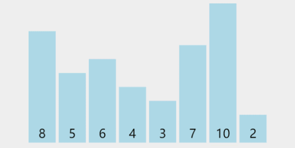
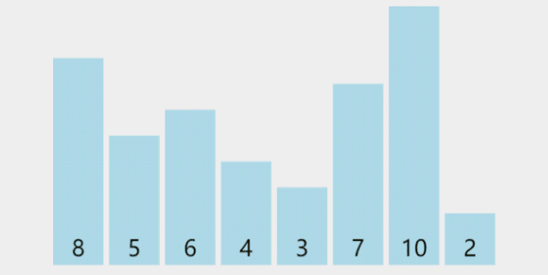
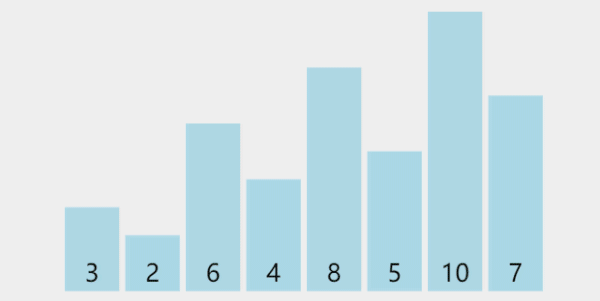

## 释义

### 目的

将原本乱序的数组变成有序，可以是「**升序** 」或者 **降序」** （为了描述统一，本文一律只讨论 **「 升序」** 的情况）。

### 思想

【希尔排序】是把数据按下标的一定【增量】进行分组，对每组使用【简单插入排序】算法进行排序；随着【增量】逐渐减少，每组包含的数据越来越多，当【增量】减至 1 时，所有数据恰被分成一组，最后执行一次【简单插入排序】后，算法终止。

### 命名由来

该算法是由 希尔 （Donald Shell）于 1959 年提出的一种排序算法，故此命名【希尔排序】

## 演示



一下子可能不是很好懂，拆开来看一下。

第一趟分解后，如下图所示：



增量为 4，所有元素共分为 4 组，分别为 [8, 3], [5, 7], [6, 10], [4, 2]，同组内部分分别执行插入排序，得到 [3, 8]，[5, 7]，[6, 10]，[2, 4] （由于每组只有两个元素，所以升序的情况位置不变，降序情况执行组内元素位置交换，抖动一下表示保持原顺序不变，有一种“我不换~~我不换”的意思在里面）。

第三趟分解后，如下图所示：



增量为 1，所有元素归为 1 组，为 [3, 2, 6, 4, 8, 5, 10, 7]。对它执行简单插入排序，执行完毕后，必然可以保证所有元素有序。

## 实现

### 插入排序

### 增量的实现

下标要满足一个等差数列的关系。假设数据元素存储在数组 $a[0\dots n-1]$ 中，增量用变量 $gap$ 来表示，那么 $a[i], a[i + gap], a[i + gap * 2], \dots, a[i + gap * k]$ 会被分到同一组。每次组内排序就是在这个增量数组中执行插入排序。

### 问题描述

> 给定一个 n 个元素的数组，数组下标从 0 开始，采用【希尔排序】将数组按照【升序】排列

### 代码实现

```typescript
const shellSort = (nums: number[]) => {
    const n = nums.length;
    let gap = 0;
    let i = 0, j = 0;
    for (gap = Math.floor(n/2); gap > 0; gap /= 2) {
        for (i = gap; i < n; i++) {
            const tmp = nums[i];
            for (j = i; j >= gap; j -= gap) {
                if (tmp < nums[j - gap]) {
                    nums[j] = nums[j - gap];
                } else {
                    break;
                }
            }
            nums[j] = tmp;
        }
    }
}
```

时间复杂度：$O(n^{1.3-2})$

空间复杂度：$O(1)$


  


