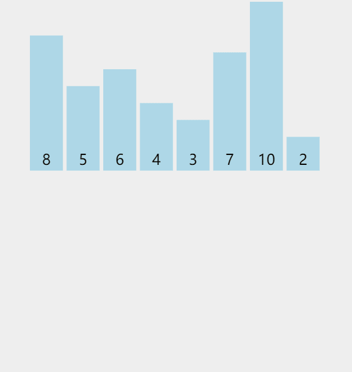

## 释义

### 算法目的

将原本乱序的数组变成有序，可以是 $\lceil 升序 \rfloor$ 或者 $\lceil 降序 \rfloor$ （为了描述统一，本文只讨论 升序 的情况）

### 算法思想

通过将当前乱序数组分成长度近似的两份，分别进行【递归】调用，然后再对这两个排好序的数组，利用两个指针，将数组元素依次比较，选择相对较小的元素存到一个【辅助数组】中，再将【辅助数组】中的数据存回【原数组】

## 算法演示



| 图示           | 含义                 |
| -------------- | -------------------- |
| 青色的柱形     | 代表尚未排好序的数   |
| 红色的柱形     | 代表已经排好序的数   |
| 其他颜色的柱形 | 正在递归、归并中的数 |

## 算法实现

### 问题描述

> 给定一个 $n$ 个元素的数组，数组下标从 $0$ 开始，采用【归并排序】将数组按照【升序】排列

```typescript
const mergeSort(nums: number[], l: number, r: number) {
    const tmp = [];
    if (l >= r) {
        return;
    }
    const mid = (l + r) >> 1;
    mergeSort(nums, l, mid);
    mergeSort(nums, mid + 1, r);
    let p = 0, lp = l, rp = mid + 1;
    while (lp <= mid || rp <= r) {
        if (lp > mid) {
            tmp[p++] = nums[rp++];
        } else if (rp > r) {
            tmp[p++] = nums[lp++];
        } else {
            if (nums[lp] <= nums[rp]) {
                tmp[p++] = nums[lp++];
            } else {
                tmp[p++] = nums[rp++];
            }
        }
    }
    for (let i = 0; i < r-l+1; i++) {
        nums[l+i] = tmp[i];
    }
}
```

时间复杂度：$O(n\log_2n)$，归并操作 $O(n)$ ，总共归并 $\log_2n$ 次

空间复杂度：$O(n)$


