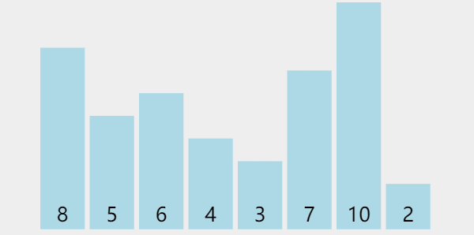

## 思想

随即找到一个位置，将比它小的数都放到它的 **左边**，比它大的数都放到它的 **右边**，然后分别递归求解，使左右两边都有序。

- 【递归】：函数通过改变参数，自己调用自己
- 【比较】：关系运算符 $\lt$ 的运用
- 【分治】：分而治之，先分，再治。即将问题拆分成更小的子问题，分别解决

## 动画



## 源码

```typescript
function quickSort(nums: number[], l: number = 0, r: number = nums.length - 1) {
    if (l < r) {
        const id = Math.floor((Math.random() * (r-l)) + l);
        const val = nums[id];
        [nums[l], nums[id]] = [nums[id], nums[l]];
        let i = l + 1, j = l + 1;
        while (i <= r) {
            if (nums[i] < val) {
                [nums[i], nums[j]] = [nums[j], nums[i]];
                j++;
            }
            i++;
        }
        [nums[j-1], nums[l]] = [nums[l], nums[j-1]];
        quickSort(nums, l, j-1-1);
        quickSort(nums, j-1+1, r);
    }
    return nums;
}
```

