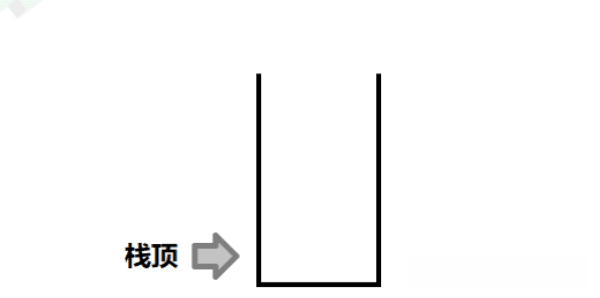
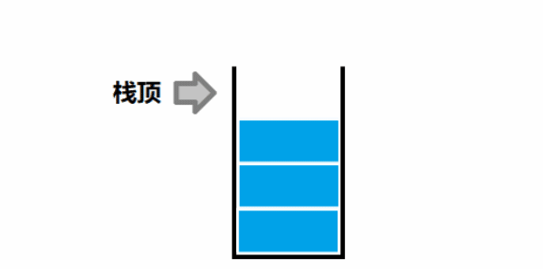

## 概念

### 栈的定义

**栈** 是仅限在 **表尾** 进行 **插入** 和 **删除** 的 **线性表**。

**栈** 又被成为 后进先出（Last In First Out）的线性表，简称 LIFO。

### 栈顶

栈是一个线性表，我们把允许插入和删除的一端称为 **栈顶**。


### 栈底

和栈顶相对，另一端称为 **栈底**，实际上，栈底元素我们一般不需要关心。


## 接口

### 可写接口

#### 数据入栈




#### 数据出栈



#### 清空栈


### 只读接口

#### 获取栈顶数据

对于一个栈来说一般只能获取栈顶的数据，不支持其他数据的获取。

#### 获取栈元素个数

栈元素个数一般用一个额外变量存储，入栈时加一，出栈时减一。这样获取栈元素的时候就不需要遍历整个栈。可以通过 $O(1)$ 的时间复杂度来获取栈元素个数。

#### 栈的判空

当栈元素个数为零时，就是一个空栈，空栈不允许 **出栈** 操作。

## 栈的顺序表实现

> C 语言中，循序表表现为数组（很多语言都是），考虑以下几个点：
>
> 1. 栈数据的存储方式，以及栈数据的数据类型
> 2. 栈的大小
> 3. 栈顶指针

### 数据结构定义

```c
#define DataType int;
#define maxn 100005;
struct Stack {
    DataType data[maxn];
    int top;
}
```

### 入栈

```c
void StackPushStack(struct Stack *stk, DataType dt) {
    stk->data[stk->top++] = dt;
}
```

### 出栈

```c
void StackPopStack(struct Stack* stk) {
    stk->top--;
}
```

### 清空栈

```c
void StackPopStack(struct Stack* stk) {
    stk->top = 0;
}
```

### 只读接口

包括：获取栈顶元素、获取栈大小、栈的判空。

```c
DataType StackGetTop(struct Stack* stk) {
    return stk->data[stk->top - 1];
}
int StackGetSize(struct Stack* stk) {
    return stk->top;
}
bool StackIsEmpty(struct Stack* stk) {
    return !StackGetSize(stk);
}
```

## 栈的链表实现

### 数据结构定义

```c
typedef int DataType;

struct StackNode;
struct StackNode {
    DataType data;
    struct StackNode *next;
}
Struct Stack {
    struct StackNode *top;
    int size;
}
```

### 入栈

```c
void StackPushStack(struct Stack *stk, DataType dt) {
    struct StackNode *insertNode = (struct StackNode *) malloc(sizeof(struct StackNode));
    insertNode->DataType = dt;
    insertNode->next = stk->top;
    stk->size++;
    stk->top = insertNode;
    return stk;
}
```

### 出栈

```c
void StackPopStack(struct Stack *stk) {
    struct StackNode *temp = stk->top;
    stk->top = temp->next;
    free(temp);
    stk->size--;
}
```

### 清空栈

```c
void StackClear(struct Stack *stk) {
    while(!StackIsEmpty(stk)) {
        StackPopStack(stk);
    }
    stk->top = NULL;
}
```

### 只读接口

包括：获取栈顶元素、获取栈大小、栈的判空

```c
DataType StackGetTop(struct Stack *stk) {
    return stk->top->data;
}
int StackGetSize(struct Stack *stk) {
    return stk->top;
}
int StackIsEmpty(struct Stack* stk) {
    return !StackGetSize(stk);
}
```


