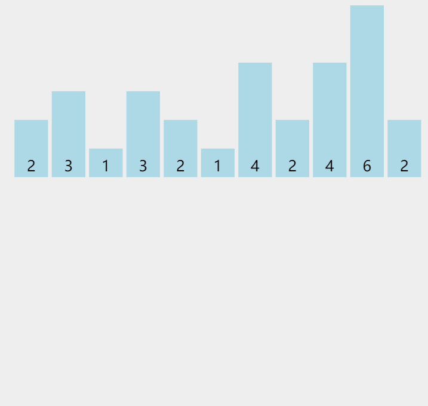

## 释义

### 算法目的

将原本乱序的数组变成有序，可以是【升序】或者【降序】，本文只讨论【升序】

### 算法思想

首先，准备一个【计数器数组】，通过一次【枚举】，对所有【原数组】元素进行比较。

然后，【从小到大】枚举所有数，按照【计数器数组】内的个数，将枚举到的数放回【原数组】。

执行完毕以后，所有元素必定按照【升序】排列。

## 演示



## 算法描述

### 问题描述

> 给定一个 $n$ 个元素的整型数组，数组下标从 0 开始，且数组元素范围为 $[1, 10^5]$，采用【计数排序】将数组按照【升序】排列

### 算法实现

```typescript
const countingSort(nums: number[]) {
    const tmp = [];
    for (let i = 0; i < nums.length; i++) {
        if (tmp[nums[i]] == null) {
            tmp[nums[i]] = 1;
        } else {
            tmp[nums[i]]++;
        }
    }
    let p = 0;
    for (let i = 0; i < tmp.length; i++) {
        while (tmp[i]) {
            a[p++] = i;
            tmp[i]--;
        }
        if (p === nums.length) {
            break;
        }
    }
}
```

枚举所有数字时间复杂度 $O(n)$

枚举范围内的数字，时间复杂度 $O(k)$

总时间复杂度：$O(n+k)$


