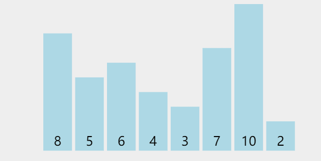

## 动画



## 源码

```typescript
function selectionSort(nums: number[]) {
    let min: number;
    for (let i = 0; i < nums.length; i++) {
        min = nums.length - 1;
        for (let j = i+1; j < nums.length; j++) {
            if (nums[j] < nums[min]) {
                min = j;
            }
        }
        [nums[i], nums[min]] = [nums[min], nums[i]];
    }
}
```


