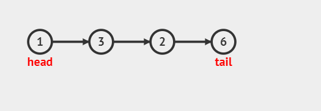

## 概念

对于顺序存储的结构，如数组，最大的缺点就是：插入和删除的时候需要移动大量的元素。所以，基于前人的智慧，他们发明了链表。

### 链表定义

> 链表是由一个个结点组成，每个结点之间通过链接关系串联起来，每个结点都有一个后继节点，最后一个结点的后继节点为空结点。


链表可以分为：

- 单向链表
- 双向链表
- 循环链表

### 结点结构体定义

```c
typedef int DataType;
struct ListNode {
    DataType data; // 数据域
    ListNode *next; // 指针域
}
```

### 结点的创建

```c
ListNode *ListCreateNode(DataType data) {
    ListNode *node = (ListNode *) malloc(sizeof(ListNode));
    node->data = data;
    node->next = NULL;
    return node;
}
```

## 链表的创建——尾插法

> 尾插法，顾名思义，即从链表的尾部插入，即记录一个链表尾结点，然后遍历给定数组，将数组元素一个一个插到链表的尾部，每插入一个结点，则将它更新为新的链表尾结点。初始情况时，链表尾节点为空。


```c
ListNode *ListCreateListByTail(int n, int a[]) {
    ListNode *head, *tail, *vtx;
    int idx;
    if (n <= 0) {
        return NULL;
    }
    idx = 0;
    vtx = ListCreateNode(a[0]);
    head = tail = vtx;
    while(++idx < n) {
        vtx = ListCreateNode(a[idx]);
        tail->next = vtx;
        tail = vtx;
    }
    return head;
}
```

## 链表的创建——头插法

> 头插法，顾名思义，就是每次从头结点前面进行插入，但是这样一来，就会导致插入的数据元素是逆序的，所以我们需要逆序访问数组执行插入，此所谓负负得正的思想。


```c
ListNode *ListCreateListByHead(int n, int *a) {
    ListNode *head = NULL, *vtx;
    while(n--) {
        vtx = ListCreateNode(a[n]);
        vtx->next = head;
        head = vtx;
    }
    return head;
}
```

## 链表的打印

### 打印的作用

- 可视化：帮助我们更好的理解数据结构

```c
void ListPrint(ListNode *head) {
    ListNode *vtx = head;
    while(vtx) {
        printf("%d->", vtx->data);
        vtx = vtx->next;
    }
    printf("NULL\n");
}
```

## 链表元素的索引

```c
ListNode *ListGetNode(ListNode *head, int i) {
    ListNode *temp = head;
    int j = 0;
    while(temp && j < i) {
        temp = temp->next;
        j++;
    }
    if (!temp || j > i) {
        return NULL;
    }
    return temp;
}
```

## 链表元素的查找

```c
ListNode *ListFindNodeByValue(ListNode *head, DataType v) {
    ListNOde *temp = head;
    while(temp) {
        if (temp->data == v) {
            return temp;
        }
        temp = temp->next;
    }
    return NULL;
}
```

## 链表节点的插入



```c
ListNode *ListInsertNode(ListNode *head, int i, DataType v) {
    ListNode *pre, *vtx, *aft;
    int j = 0;
    pre = head;
    while(pre && j < i) {
        pre = pre->next;
        j++;
    }
    if (!pre) {
        return NULL;
    }
    vtx = ListCreateNode(v);
    vtx->next = pre->next;
    pre->next = vtx;
    return vtx;
}
```

## 链表结点的删除


```c
ListNode *ListDeleteNode(ListNode *head, int i) {
    ListNode *pre, *del, *aft;
    int j = 0;
    if (head == NULL) {
        return NULL;
    }
    if (i == 0) {
        del = head;
        head = head->next;
        free(del);
        return head;
    }
    pre = head;
    while(pre && j < i - 1) {
        pre = pre->next;
        j++;
    }
    if (!pre || !pre->next) {
        return head;
    }
    del = pre->next;
    pre->next = del->next;
    free(del);
    return head;
}
```

## 链表的销毁


```c
void ListDestroyList(ListNode **pHead) {
    ListNode *head = *pHead;
    while(head) {
        head = ListDeleteNode(head, 0);
    }
    *pHead = NULL;
}
```

这里必须用二级指针，因为删除后需要将链表头置空，普通的指针传参无法影响外部指针变量。


