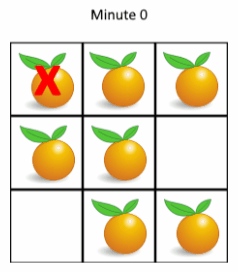

## 滑动窗口最大值 $\star$

> 给你一个整数数组 nums，有一个大小为 k 的滑动窗口从数组的最左侧移动到数组的最右侧。你只可以看到在滑动窗口内的 k 个数字。滑动窗口每次只向右移动一位。返回滑动窗口中的最大值。
>
> 样例输入：nums = [1,3,-1,-3,5,3,6,7], k = 3
>
> 样例输出：[3,3,5,5,6,7]

```typescript
function maxSlidingWindow(nums: number[], k: number) {
    const queue = [];
    const res = [];
    
    function addQueue(i: number) {
        if (queue.length) {
            if (queue[0] < nums[i]) {
                queue.shift();
            }
        }
        queue.push(i);
    }

    for (let i = 0; i < nums.length; i++) {
        if (i <= k) {
            addQueue(i);
        } else {
            res.push(nums[queue[0]]);
            if (i === queue[0]) {
                queue.shift();
            }
            addQueue(i);
        }
    }
    res.push(queue[0]);
	return res;
}
```

## 最近的请求次数

> 写一个 RecentCounter 类来计算特定时间范围内最近的请求。实现 RecentCounter 类：
>
> 1. RecentCounter()：初始化计数器，请求数为 1
> 2. int ping(int t)：在时间 t 添加一个新请求，其中 t 表示以毫秒为单位的某个时间，并返回过去 3000 毫秒内发生的所有请求数（包括新请求）。确切地说，返回在 $[t-3000, t]$ 内发生的请求数。保证每次对 ping 的调用都使用比之前更大的 t 值。
>
> 样例输入：
>
> ["RecentCounter", "ping", "ping", "ping", "ping"]
>
> [[], [1], [100], [3001], [3002]]
>
> 样例输出：
>
> [null, 1, 2, 3, 3]

```typescript
class RecentCounter {
    queue: number[];
    constructor() {
        this.queue = [];
    }
    ping(t: number) {
        this.queue.push(t);
        while (t - this.queue[0] > 3000) {
            this.queue.shift();
        }
        return this.queue.length;
    }
}
```

## 数据流中的移动平均值

> 给定一个整数数据流和一个窗口大小，根据该滑动窗口的大小，计算华东窗口里所有数字的平均值。实现 MovingAverage 类：
>
> MovingAverage(int size): 用窗口大小 size 初始化对象
>
> double next(int val): 成员函数 next 每次调用的时候都会往滑动窗口增加一个整数，请计算并返回数据流中最后 size 个值的移动平均值，即滑动窗口里所有数字的平均值。
>
> 样例输入：
>
> ["MovingAverage", "next", "next", "next", "next"]
>
> [[3], [1], [10], [3], [5]]
>
> 样例输出：
>
> [null, 1.0, 5.5, 4.66667, 6.0]

```typescript
class MovingAverage {
    size: number;
    queue: number[];
    sum: number;
    constructor(size: number) {
        this.size = size;
        this.queue = [];
        this.sum = 0;
    }
    next(val: number) {
        if (!this.queue.length || this.queue.length < this.size) {
            this.queue.push(val);
            this.sum += val;
            return this.sum / this.queue.length;
        } else if (this.queue.length >= this.size) {
            const del = this.queue.shift();
            this.queue.push(val);
            this.sum = this.sum - del + val;
        }
        return this.sum / this.size;
    }
}
```

## 矩阵 TODO

> 给定一个由 0 和 1 组成的矩阵 mat，请输出一个大小相同的矩阵，其中每一个格子是 mat 中对应位置元素到最近的 0 的距离。两个相邻元素间的距离为 1。

## 腐烂的橘子 $\star$

> 在给定的网格中，每个单元格可以有以下三个值之一：
>   1）值 0 代表空单元格；
>   2）值 1 代表新鲜橘子；
>   3）值 2 代表腐烂的橘子。
> 每分钟，任何与腐烂的橘子（在 4 个正方向上）相邻的新鲜橘子都会腐烂。返回直到单元格中没有新鲜橘子为止所必须经过的最小分钟数。如果不可能，返回 -1。
>
> 
>
>   样例输入：$\left[ \begin{matrix} 2 & 1 & 1 \\ 1 & 1 & 0 \\ 0 & 1 & 1\end{matrix} \right]$
>
>   样例输出： 4
>

```typescript
type Point = {
  x: number;
  y: number;
}

function orangesRotting(vector: number[][]) {
  const rottenQueue: Point[] = [];
  let minutes = 0;
  let freshOranges = 0;

  function couldRotting(x: number, y: number) {
    return (y >= 0 && y < vector.length)
      && (x >= 0 && x < vector[0].length)
      && vector[y][x] === 1;
  }

  function rotten(x: number, y: number) {
    if (couldRotting(x, y)) {
      vector[y][x] = 2;
      rottenQueue.push({x, y});
      freshOranges--;
    }
  }

  function isFreshOrangesEmpty() {
    return !freshOranges;
  }

  // init
  for (let y = 0; y < vector.length; y++) {
    for (let x = 0; x < vector[y].length; x++) {
      if (vector[y][x] === 2) {
        rottenQueue.push({x, y});
      }
      if (vector[y][x] === 1) {
        freshOranges++;
      }
    }
  }

  if (isFreshOrangesEmpty()) {
    return minutes;
  }

  let count = 0;
  let total = rottenQueue.length;
  while(rottenQueue.length) {
    if (count >= total) {
      minutes++;
      count = 0;
      total = rottenQueue.length;
      if (isFreshOrangesEmpty()) {
        return minutes;
      }
    }
    const { x = 0, y = 0 } = rottenQueue.shift() || {};
    rotten(x-1, y);
    rotten(x+1, y);
    rotten(x, y-1);
    rotten(x, y+1);
    count++;
  }

  minutes++;

  if (isFreshOrangesEmpty()) {
    return minutes;
  }

  return -1;
}

console.log(orangesRotting([[2,1,1], [1,1,0], [0,1,1]])); // 4
console.log(orangesRotting([[0,2]])) // 0
console.log(orangesRotting([[1,2]])) // 1
console.log(orangesRotting([[2,2,2,1,1]])) // 2
```

## 填充每个节点的下一个右侧节点指针 TODO

```typescript
function connect() {
    
}
```

## 跳跃游戏 VI $\star$

> 给定一个下标从 0 开始的整数数组 nums[] 和一个整数 k。一开始在下标 0 处。每一步，你最多可以往前跳 k 步，但不能跳出数组的边界。也就是说，可以从下标 i 跳到 [i+1, min(n-1, i+k)] 包含两个端点的任意位置。
>
> 目标是到达数组最后一个位置（下标为 n-1），得分为经过的所有数字之和。请返回能得到的最大得分。
>
> 样例输入：
>
> nums = [1,-1,-2,4,-7,3]
>
> k = 2
>
> 样例输出：7

```typescript
function maxResult(nums: number[], k: number) {
  const queue: number[] = [0];
  const dp: number[] = [nums[0]];

  for (let i = 1; i < nums.length; i++) {
    while (queue.length && i - k > queue[0]) {
      queue.shift();
    }
    dp[i] = nums[i] + dp[queue[0]];
    while(queue.length && dp[queue[queue.length - 1]] <= dp[i]) {
      queue.pop();
    }
    queue.push(i);
  }

  return dp[nums.length - 1];
}
```

## 绝对差不超过限制的最长连续子数组 $\star$

> 给你一个整数数组 nums，和一个表示限制的整数 limit，请你返回最长连续子数组的长度，该子数组中任意两个元素之间的绝对差必须小于或者等于 limit。如果不存在满足条件的子数组，则返回 0。
>
> 样例输入：
>
> nums = [8,2,4,7]
>
> limit = 4
>
> 样例输出：
>
> 2

```typescript
function longestSubarray(nums: number[], limit: number) {
  let max = 0;
  const queue: number[] = [];

  console.log('nums Length: ', nums.length);

  function isMaxOutLimit(num: number) {
    return Math.abs(num - getNumFromQueue(0)) > limit;
  }

  function isMinOutLimit(num: number) {
    return Math.abs(num - getNumFromQueue(queue.length - 1)) > limit;
  }

  function isOutLimit(num: number) {
    return isMaxOutLimit(num) || isMinOutLimit(num);
  }

  function getNumFromQueue(index: number) {
    return nums[queue[index]];
  }

  for (let i = 0; i < nums.length; i++) {
    if (queue.length) {
      if (isOutLimit(nums[i])) {
        if (max < queue.length) {
          max = queue.length;
        }
        while (isMinOutLimit(nums[i])) {
          i = queue.pop()!;
        }
        while (isMaxOutLimit(nums[i])) {
          i = queue.shift()!;
        }
        queue.length = 0;
        continue;
      } else {
        if (nums[i] <= getNumFromQueue(0)) {
          queue.unshift(i);
          continue;
        } else if (nums[i] <= getNumFromQueue(queue.length - 1)) {
          const arr: number[] = [];
          while (getNumFromQueue(queue.length - 1) > nums[i]) {
            arr.unshift(queue.pop()!);
          }
          queue.push(i);
          queue.push(...arr);
          continue;
        }
      }
    }
    queue.push(i);
  }

  if (queue.length > max) {
    max = queue.length;
  }

  return max;
}

function longestSubarrayAnother(nums: number[], limit: number) {
  const maxQueue: number[] = [];
  const minQueue: number[] = [];

  let max = 0;
  let index = 0;

  for (let i = 0; i < nums.length; i++) {
    while (nums[i] > nums[maxQueue[maxQueue.length - 1]]) {
      maxQueue.pop();
    }
    while (nums[i] < nums[minQueue[minQueue.length - 1]]) {
      minQueue.pop();
    }
    maxQueue.push(i);
    minQueue.push(i);

    while (maxQueue.length) {
      if (nums[maxQueue[0]] - nums[minQueue[0]] > limit) {
        index++;
        while (maxQueue[0] < index) {
          maxQueue.shift();
        }
        while (minQueue[0] < index) {
          minQueue.shift();
        }
      } else {
        break;
      }
    }
    if (i - index + 1 > max) {
      max = i - index + 1;
    }
  }

  return max;
}
```

## 带限制的子序列和 $\star$

> 给定一个整数数组 nums 和一个整数 k，请返回 非空 子序列元素和的最大值，子序列需要满足：子序列中每两个相邻的整数 nums[i] 和 nums[j]，它们在原数组中的下标 i 和 j 满足 i < j 且 j - i <= k。
>
> 数组子序列的定义：将数组中若干个数字删除（可删除 0 个数字），剩下的数字按照原本的顺序排布。
>
> 样例输入：
>
> nums = [10,2,-10,5,20]
>
> k = 2
>
> 样例输出：
>
> 37

```typescript
function constrainedSubsetSum(nums: number[], k: number) {
  const queue: number[] = [];
  const dp: number[] = [];
  let max: number = -Infinity;

  for (let i = 0; i < nums.length; i++) {

    while (queue.length && i - queue[0] > k) {
      queue.shift();
    }

    if (dp.length) {
      const top = dp[queue[0]];
      dp[i] = top > 0 ? nums[i] + top : nums[i];
    } else {
      dp[i] = nums[i];
    }

    while (queue.length && dp[queue[queue.length - 1]] <= dp[i]) {
      queue.pop();
    }

    queue.push(i);

    if (dp[i] > max) {
      max = dp[i];
    }
  }

  return max;
}
```


