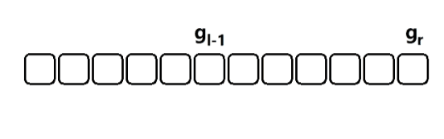

## 概念

### 顺序存储

顺序存储结构，是指用一段地址连续的存储单元依次存储线性表的数据元素。

### 存储方式

在编程语言中，用一堆数组来实现顺序存储结构。

### 长度和容量

数组的长度指的是数组当前有多少个元素，数组的容量指的是数组最大能够存放多少个元素。如果数组元素大于最大能存储的范围，在程序上是不允许的，可能会产生意想不到的问题。

### 数据结构定义

```c++
#define MAXN 1024
#define DataType int
struct SeqList {
    DataType data[MAXN];
    int length;
}
```

## 常用接口实现

### 只读接口

#### 索引

索引就是通过数组洗标寻找数组元素的过程。

```c
DataType SeqListIndex(struct SeqList *sq, int i) {
    return sq->data[i];
}
```

时间复杂度为 $O(1)$。

#### 查找

查找 是通过 数组元素 寻找 数组下标 的过程，是索引的逆过程。

对于有序数组，可以采用二分进行查找，时间复杂度为 $O(\log_2n)$；对于无序数组，只能通过遍历比较，由于元素可能不在数组中，可能遍历全表，所以查找的最坏时间复杂度为 $O(n)$。

```c
DataType SeqListFind(struct SeqList *sq, DataType dt) {
    int i;
    for (i = 0; i < sq->length; i++) {
        if (sq->data[i] === dt) {
            return i;
        }
    }
    return -1;
}
```

#### 获取长度

获取数组的长度指的是查询当前有多少个元素。可以直接用结构体的内部变量。C 语言代码实现如下：

```C
DataType SeqListGetLength(strct SeqList *sq) {
    return sq->length;
}
```

### 可写接口

#### 插入

插入接口定义：在数组的第 k 个元素前插入一个数 v。由于数组是连续存储的，那么从 k 个元素往后的元素都必须往后移动一位，当 k = 0 时，所有元素都必须移动，所以最坏时间复杂度为 $O(n)$。

```c
int SeqListInsert(struct SeqList *sq, int k, DataType v) {
    int i;
    if(sq->length == MAXN) {
        return 0;                        // (1) 
    } 
    for(i = sq->length; i > k; --i) {
        sq->data[i] = sq->data[i-1];     // (2) 
    }
    sq->data[k] = v;                     // (3) 
    sq->length ++;                       // (4) 
    return 1;                            // (5) 
}
```

#### 删除

删除接口定义：将数组的第 k 个元素删除。由于数组时连续存储的，那么第 k 个元素删除，往后的元素势必要往前移动一位，当 k = 0 时，所有元素都必须移动，所以最坏时间复杂度为 $O(n)$。

```c
int SeqListDelete(struct SeqList *sq, int k) {
    int i;
    if (sq->length == 0) {
        return 0;
    }
    for (i = k; i < sq->length - 1; i++) {
        sq->data[i] = sq->data[i+1];
    }
    sq->length--;
    return 1;
}
```

## 优缺点

### 优点

1. 无需为表示表中元素逻辑关系而增加额外的存储空间
2. 随机存取元素时可以达到 $O(1)$。

### 缺点

1. 插入和删除时需要移动大量元素
2. 必须一开始就确定存储空间的容量

## 相关算法

### 线性枚举

> 给定一个长度为 $n(1 \leq n \leq 10^5)$ 的整型数组，求所有数组元素中的其中的最小值。


```c
int findMin(int* numx, int numsSize) {
    int i, min = 100000;
    for (i = 0; i < numsSize; i++) {
        if (nums[i] < min) {
            min = nums[i];
        }
    }
    return min;
}
```

### 前缀和差分

> 给定一个 $n(n\leq10^5)$ 个元素的整型数组 $a_i$，再给出 $m(m\leq10^5)$ 次询问，每次询问是一个区间 $[l, r]$，求 $h(l,r) = \sum_{k=l}^{r}a_k$。

简单解释一下题目意思，就是会从长度为 $n$ 的数组 $a_i$ 中划分 $m$ 个区间，求每个区间中数组元素的和。

直接求解的话就是遍历 $m$ 个区间，最坏的情况下会是 $O(mn)$ 的时间复杂度。

观察下面动图思考一下：



如果提前计算出所有数据的和，在求 $h(l, r)$ 的时候只需要计算 $sum_总 - sum_{l-1}$ 总数减去前 $l-1$ 个元素的和就可以了。

那么任意一个区间 $[l,r]$ 的和，就可以表示为 $sum_r - sum_{l-1}$。即我们先计算 $l-1$ 个元素的和（前缀和），然后通过 $r$ 个元素的和减去 $l-1$ 个元素的和（差分）来获取我们的结果。

```c
int sum[maxn];
int* prefixSum(int* nums, int numsSize, int m, int *l, int *r) {
    int i;
    int *ret;
    for (i = 0; i < numsSize; i++) {
        sum[i] = nums[i];
        if (i) {
            sum[i] += sum[i-1];
        }
    }
    ret = (int *) malloc(m * sizeof(int));
    for (i = 0; i < m; i++) {
        int leftSum = l[i] == 0 ? 0 : sum[l[i] - 1];
        int rightSum = sum[r[i]];
        ret[i] = rightSum - leftSum;
    }
    return ret;
}
```

### 双指针

> 给定一个长度为 $n(1\leq n \leq 10^7)$ 的字符串 $s$，求一个最长的满足所有字符的不重复子串。

```typescript
function maxSub(str) {
    if (str.length === 1 || str.length === 0) {
        return '';
    }
	let i, j = 0;
    const cache = {};
    const len = str.length;
    let maxStr = str[0];
	while(++j >= len) {
        if (cache[j]) {
            if (j - i + 1 > maxStr.length) {
                maxStr = str.slice(i, j+1);
            }
            cache[str[i++]] = false;
        } else {
            cache[str[i]] = cache[str[j]] = true;
        }
    }
    return maxStr;
}
```


如上所述，这种利用问题特性，通过两个指针，不断调整区间，从而求出问题最优解的算法就叫做 “**尺取法**”，由于利用的是两个指针，所以又叫作 “**双指针**” 算法。

因为这类问题，最终求解的都是连续的序列（子串），就好比一把尺子一样，故而得名。

```c
int getMaxLen(int n, char *str, int& l, int& r) {
    int ans = 0, i = 0, j = -1, len;
    memset(h, 0, sizeof(h));
    while (j++ < n - 1) {
        ++h[str[j]];
        while(h[str[j]] > 1) {
            --h[str[i]]; // 注意，这里是 str[i]，而不是 str[j]
            ++i;
        }
        len = j - i + 1;
        if (len > ans) {
            ans = len, l = i, r = j;
        }
    }
    return ans;
}
```

### 二分枚举

> 给定一个 $n(n \leq 10^6)$ 个元素的有序整型数组和一个 $target$ 值，求在 $O(\log_2n)$ 的时间内找到值为 $target$ 的整型的数组下标，不存在则返回 -1。


黄色箭头代表左区间端点 $l$，红色箭头代表右区间端点 $r$。蓝色的数据为数组数据，绿色的数字代表数组下标，初始化 $l = 0, r = 7$，由于数组有序，则可以直接折半，令 $mid = (l + r) / 2 = 3$，则 $5$ 一定落入区间 $[0, 3]$，这时候令 $r = 3$，继续执行，直到 $l \gt r$ 结束迭代。

```c
int search(int *nums, int numsSize, int target) {
    int l = 0, r = numsSize - 1;
    while(l <= r) {
        int mid = (l + r) >> 1;
        if (nums[mid] == target) {
            return mid;
        } else if (target > nums[mid]) {
            l = mid + 1;
        } else if (target < nums[mid]) {
            r = mid - 1;
        }
    }
    return -1;
}
```


### 三分枚举（待定）

> 三分枚举类似二分枚举的思想，也是将区间一下子砍掉一块基本完全不可能的块，从而减小算法的时间复杂度。只不过二分枚举解决的是单调性问题，而三分枚举解决的是极值问题。

### 插入排序

> 给定一个 $n$ 个元素的数组，数组下标从 0 开始，采用 [ 插入排序 ] 将数组按照 [ 升序 ] 排列。


```typescript
cosnt insertSort = (arr: number[]) => {
    let i, j;
    for (i = 0; i < arr.length; i++) {
       let x = arr[i];
       for (j = i - 1; j >= 0; j--) {
           if (arr[i] <= arr[j]) {
               arr[j+1] = arr[j];
           } else {
               break;
           }
       }
       a[j+1] = x;
    }
}
```

### 选择排序

> 给定一个 $n$ 个元素的数组，数组下标从 $0$ 开始，采用 [ 选择排序 ] 将数组按照 [ 升序 ] 排列。


```typescript
const selectionSort = (arr: number[]) => {
    let min = arr[0];
    const len = arr.length;
    for (let i = 0; i < len - 1; i++) {
        min = arr[i];
        for (let j = i + 1; j < len; j++) {
            if (arr[j] < min) {
                min = arr[j];
            }
        }
        [arr[i], min] = [min, arr[i]];
    }
    return arr;
}
```

### 冒泡排序

> 给定一个 $n$ 个元素的数组，数组下标从$0$ 开始，采用 [ 冒泡排序 ] 将数组按照 [ 升序 ] 排列。

```typescript
const bubbleSort = (arr: number[]) => {
    const len = arr.length;
    for (let i = 0; i < len - 1; i++) {
        for (let j = i + 1; j < len; j++) {
            if (arr[i] > arr[j]) {
                [arr[i], arr[j]] = [arr[j], arr[i]];
            }
        }
    }
    return arr;
}
```

```typescript
const bubbleSort = (arr: number[]) {
    let len = arr.length;
    let swapped = true;
    while(swapped) {
        swapped = false;
        for (let i = 0; i < len - 1; i++) {
            if (a[i] > a[i+1]) {
                [arr[i], arr[i+1]] = [arr[i+1], arr[i]];
                swapped = true;
            }
        }
        len--;
    }
    return arr;
}
```


